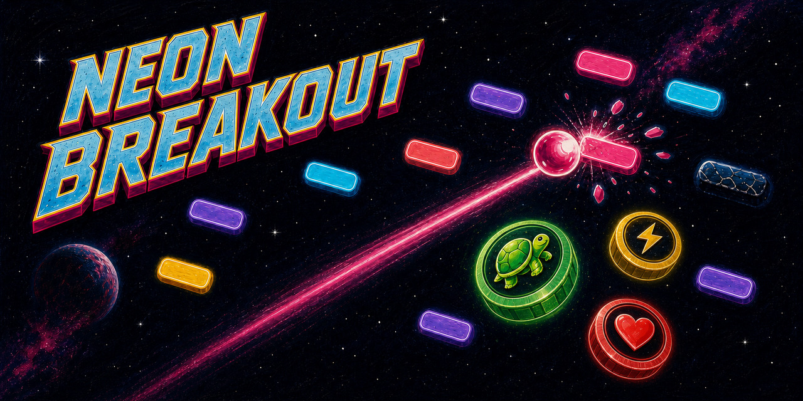

# Neon Breakout



Et fargerikt Breakout-spill for Linux, utviklet av **Yeloby**. Neon Breakout
kombinerer klassisk arkadespill med neonfarger, emoji-boostere, varierte brett
og en avslappende retroestetikk.

[**Last ned nyeste versjon**](https://github.com/Yeloby/neon-breakout/releases/latest)

## Om spillet

- Norsk og engelsk språk
- Tre vanskelighetsgrader med egen fart og poengberegning
- Varierte blokkformasjoner og forsterkede klosser
- Fjorten boostere, blant annet multiball, ildball og elektrisk ball
- Skiftende rombakgrunner, komboer og lokale topplister
- Støtte for tastatur, mus og berøringsflate

## Installering

Alle offisielle pakker finnes under
[nyeste GitHub-utgivelse](https://github.com/Yeloby/neon-breakout/releases/latest).

### Ubuntu, Debian, Linux Mint og Pop!_OS

Last ned `.deb`-filen og installer den fra nedlastingsmappen:

```bash
sudo apt install ./neon-breakout_*_amd64.deb
```

### Fedora, openSUSE og andre RPM-baserte systemer

Last ned `.rpm`-filen. På Fedora:

```bash
sudo dnf install ./neon-breakout-*.x86_64.rpm
```

På openSUSE:

```bash
sudo zypper install ./neon-breakout-*.x86_64.rpm
```

### Arch Linux og Arch-baserte systemer

Last ned `.flatpak`-filen og installer den:

```bash
flatpak install ./Neon-Breakout-*.flatpak
```

Flatpak kan installeres på Arch med `sudo pacman -S flatpak` dersom det ikke
allerede finnes på systemet.

### AppImage

AppImage krever ingen systeminstallasjon og fungerer på de fleste
Linux-distribusjoner:

```bash
chmod +x Neon.Breakout-*.AppImage
./Neon.Breakout-*.AppImage
```

## Oppdatering

Se [nyeste GitHub-utgivelse](https://github.com/Yeloby/neon-breakout/releases/latest)
og installer pakken for distribusjonen din på nytt. Innstillinger, spillernavn
og lokale poengsummer beholdes ved en vanlig oppdatering.

Automatiske oppdateringer gjennom `apt`, Flatpak og andre pakkekilder er
planlagt, men de offisielle Yeloby-kildene er ikke publisert ennå. Inntil de er
klare, er GitHub Releases den sikre og offisielle oppdateringskanalen.

## Utvikling

Krever Linux, Node.js 22.12 eller nyere og npm.

```bash
npm install
npm test
npm start
```

Bygg installasjonspakker lokalt med:

```bash
npm run build:linux
```

## Lisens og opphav

Utviklet av Johan Slåttavik under merkenavnet Yeloby.
© 2026 Johan Slåttavik. Alle rettigheter forbeholdt.
