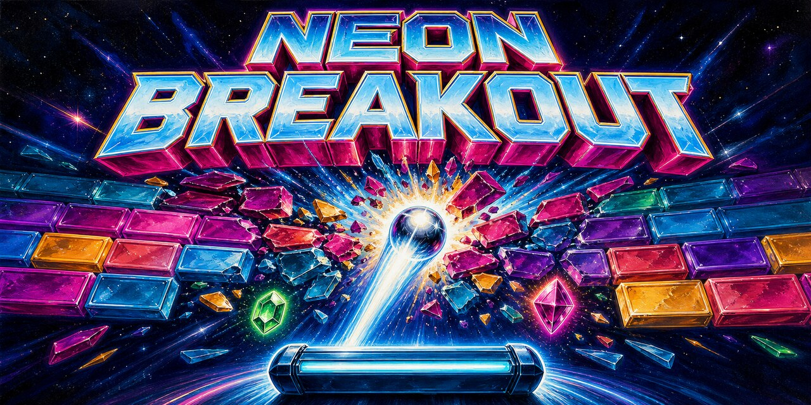

# Neon Breakout



Neon Breakout er et fargerikt, moderne Breakout-spill for Linux. Spillet er
bygget med Electron og bruker Canvas for grafikk, animasjoner og spillfysikk.

[Last ned nyeste Linux-utgivelse](https://github.com/Yeloby/neon-breakout/releases/latest)

## Funksjoner

- Tre vanskelighetsgrader med ulik ballfart og poengskalering
- Tolv varierte blokkformasjoner med ulik størrelse og tetthet
- Forsterkede klosser med flere helsepunkt og synlig sprekkdannelse
- Tre startliv og sjeldne ekstraliv
- Tretten boostere med trinnvis padelbredde og tydelige fartseffekter
- Lynenergi med bonuspoeng, elektrisk ballspor og nedtelling
- Komboer, poengeffekter og nivåfeiring
- Lokal topp 10-liste med spillernavn og vanskelighetsgrad
- Innstillinger for lyd og visuelle effekter
- Responsivt grensesnitt
- Tastatur-, mus- og pekerstyring

## Krav for utvikling

- Linux
- Node.js 22.12 eller nyere
- npm

## Kjør lokalt

Installer avhengighetene:

```bash
npm install
```

Start spillet:

```bash
npm start
```

## Tester

```bash
npm test
```

Testene dekker blant annet kollisjoner, boostere, nivåoppsett og poengtavlen.

## Bygg Linux-pakker

```bash
npm run build:linux
```

Ferdige filer legges i `dist/`:

- `.AppImage` for bred Linux-kompatibilitet
- `.deb` for Debian-baserte distribusjoner
- `.rpm` for RPM-baserte distribusjoner
- `.flatpak` for distribusjoner med Flatpak
- `.tar.gz` som portabel utgave

### AppImage

```bash
chmod +x "dist/Neon Breakout-1.3.0.AppImage"
./dist/Neon\ Breakout-1.3.0.AppImage
```

### Debian-pakke

Den nedlastede `.deb`-pakken installeres med APT, som også henter eventuelle
systemavhengigheter:

```bash
sudo apt install ./dist/neon-breakout_1.3.0_amd64.deb
```

Et eget APT-arkiv er ikke nødvendig for denne enkeltpakken. Det unngår også at
brukeren må stole på en ekstra pakkekilde og signeringsnøkkel.

### RPM-pakke

```bash
sudo dnf install ./dist/neon-breakout-1.3.0.x86_64.rpm
```

### Flatpak

Last ned `.flatpak`-filen fra GitHub-utgivelsen og installer den:

```bash
flatpak install ./Neon-Breakout-1.3.0.flatpak
flatpak run io.github.Yeloby.NeonBreakout
```

Dette er en selvstendig Flatpak-pakke. Publisering i Flathub krever i tillegg
en separat innsending og godkjenning hos Flathub.

### Portabel utgave

```bash
tar -xzf dist/neon-breakout-1.3.0.tar.gz
./neon-breakout-1.3.0/neon-breakout
```

## Utgivelser

GitHub Actions kjører tester og bygger alle Linux-formatene ved push og pull
request. En versjonstag som `v1.3.0` oppretter automatisk en GitHub Release med
installasjonspakkene som nedlastbare filer.

Genererte pakker og `node_modules` er utelatt fra Git-historikken via
`.gitignore`.

## Prosjektstruktur

- `main.js` – spilltilstand, rendering og brukergrensesnitt
- `breakoutGameLogic.js` – testbar spillogikk
- `electron-main.js` – Electron-vindu og sikkerhetsinnstillinger
- `index.html` – struktur og stil
- `tests/` – automatiserte tester

## Opphav

Utviklet av Johan Slåttavik. © 2026 Johan Slåttavik.
