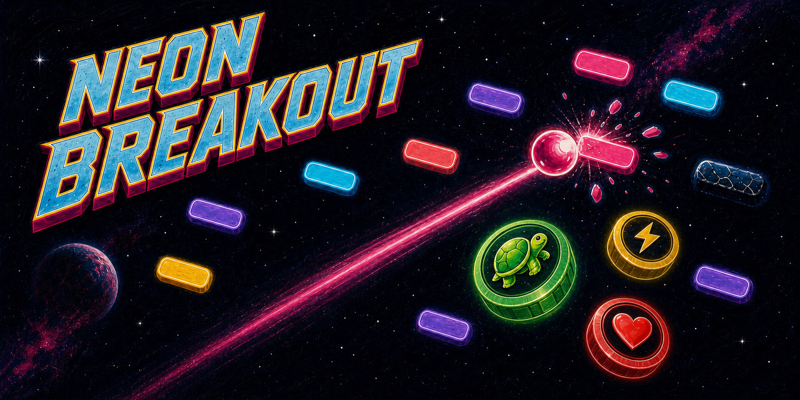

# Neon Breakout



Et fargerikt Breakout-spill for Linux, utviklet av **Yeloby**. Neon Breakout
kombinerer klassisk arkadespill med neonfarger, emoji-boostere, varierte brett
og en avslappende retroestetikk.

[**Last ned nyeste versjon**](https://github.com/Yeloby/neon-breakout/releases/latest)

## Om spillet

- Norsk og engelsk språk
- Tre vanskelighetsgrader med egen fart og poengberegning
- Varierte blokkformasjoner og forsterkede klosser
- Fjorten boostere, blant annet multiball, ildball og elektrisk ball
- Skiftende rombakgrunner, komboer og lokale topplister
- Støtte for tastatur, mus og berøringsflate

## Installering

Alle offisielle pakker finnes under
[nyeste GitHub-utgivelse](https://github.com/Yeloby/neon-breakout/releases/latest).

### Ubuntu, Debian, Linux Mint og Pop!_OS

Legg til den signerte Yeloby-kilden og installer spillet:

```bash
curl -fLO https://yeloby.github.io/neon-breakout/apt/yeloby-archive-keyring.deb
sudo apt install ./yeloby-archive-keyring.deb
sudo apt update
sudo apt install neon-breakout
```

### Fedora, openSUSE og andre RPM-baserte systemer

Last ned `.rpm`-filen. På Fedora:

```bash
sudo dnf install ./neon-breakout-*.x86_64.rpm
```

På openSUSE:

```bash
sudo zypper install ./neon-breakout-*.x86_64.rpm
```

### Arch Linux og Arch-baserte systemer

Installer Flatpak med `sudo pacman -S flatpak` dersom det ikke allerede finnes
på systemet. Legg deretter til Yeloby-kilden og installer spillet:

```bash
flatpak remote-add --if-not-exists yeloby \
  https://yeloby.github.io/neon-breakout/flatpak/yeloby.flatpakrepo
flatpak install yeloby io.github.Yeloby.NeonBreakout
```

### AppImage

AppImage krever ingen systeminstallasjon og fungerer på de fleste
Linux-distribusjoner:

```bash
chmod +x Neon.Breakout-*.AppImage
./Neon.Breakout-*.AppImage
```

## Oppdatering

Installerte du spillet fra Yeloby-kilden på et Debian-basert system, kommer nye
versjoner gjennom den vanlige systemoppdateringen:

```bash
sudo apt update
sudo apt upgrade
```

Flatpak-utgaven oppdateres med:

```bash
flatpak update
```

AppImage og manuelt installerte RPM-pakker erstattes med pakken fra
[nyeste GitHub-utgivelse](https://github.com/Yeloby/neon-breakout/releases/latest).
Innstillinger, spillernavn og lokale poengsummer beholdes ved oppdatering.

## Utvikling

Krever Linux, Node.js 22.12 eller nyere og npm.

```bash
npm install
npm test
npm start
```

Bygg installasjonspakker lokalt med:

```bash
npm run build:linux
```

## Lisens og opphav

Utviklet av Johan Slåttavik under merkenavnet Yeloby.
© 2026 Johan Slåttavik. Alle rettigheter forbeholdt.
